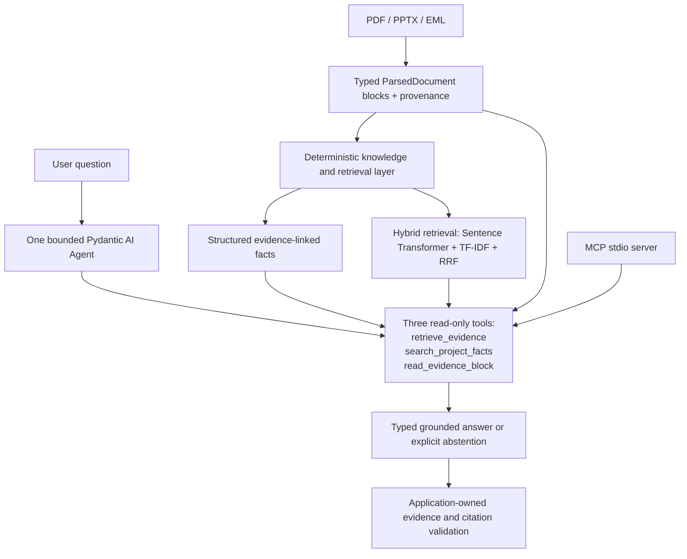

# LLM Document Intelligence, Agentic RAG & MCP Pipeline

A provenance-aware document-intelligence portfolio prototype that ingests heterogeneous business documents, extracts structured facts, retrieves grounded evidence, and exposes the same deterministic capabilities to a bounded Pydantic AI agent and a read-only MCP server.

## Portfolio highlights

- Ingests PDF, PPTX, and EML sources into typed `ParsedDocument` blocks with source, block, page, slide, and excerpt provenance.
- Improved a 15-question development retrieval benchmark from dense-only Hit@5 of 46.7% and MRR of 0.289 to hybrid Hit@5 of 86.7% and MRR of 0.535 using Sentence Transformer embeddings, TF-IDF, and Reciprocal Rank Fusion (RRF).
- Runs one bounded Pydantic AI document agent over exactly three deterministic read-only tools, with typed answers, application-owned citation validation, and explicit insufficient-evidence abstention.
- Evaluated offline deterministic agent orchestration on 20 labelled cases: 18/20 task success, 16/16 valid citations, 2/2 appropriate abstentions, and 20/20 acceptable tool selections.
- Completed a separate three-query GPT-5.4-mini development integration smoke: all three returned grounded answers containing their labelled evidence, with no reruns.
- Exposes the same retrieval, fact-search, and evidence-inspection tools through an official MCP Python SDK v2 stdio server with no embedded LLM.

## Architecture



The agent selects tools and produces a bounded final response. Parsing, embeddings, TF-IDF, RRF, fact-search semantics, provenance lookup, and citation hydration remain in the existing deterministic application layer.

## Measured results

| Evaluation | Scope | Metric | Result |
|---|---|---|---:|
| Dense-only retrieval baseline | 15-question **development** benchmark | Hit@1 | 13.3% |
| Dense-only retrieval baseline | 15-question **development** benchmark | Hit@3 | 46.7% |
| Dense-only retrieval baseline | 15-question **development** benchmark | Hit@5 | 46.7% |
| Dense-only retrieval baseline | 15-question **development** benchmark | MRR | 0.289 |
| Hybrid Sentence Transformer + TF-IDF + RRF | 15-question **development** benchmark | Hit@1 | 33.3% |
| Hybrid Sentence Transformer + TF-IDF + RRF | 15-question **development** benchmark | Hit@3 | 66.7% |
| Hybrid Sentence Transformer + TF-IDF + RRF | 15-question **development** benchmark | Hit@5 | 86.7% |
| Hybrid Sentence Transformer + TF-IDF + RRF | 15-question **development** benchmark | MRR | 0.535 |
| Agent orchestration | 20-case **offline deterministic FunctionModel** evaluation | Task success | 18/20 (90.0%) |
| Agent orchestration | 20-case **offline deterministic FunctionModel** evaluation | Citation validity | 16/16 (100.0%) |
| Agent orchestration | 20-case **offline deterministic FunctionModel** evaluation | Appropriate abstention | 2/2 (100.0%) |
| Agent orchestration | 20-case **offline deterministic FunctionModel** evaluation | Acceptable tool selection | 20/20 (100.0%) |
| Agent orchestration | 20-case **offline deterministic FunctionModel** evaluation | Unnecessary tool calls | 0/22 (0.0%) |
| Agent orchestration | 20-case **offline deterministic FunctionModel** evaluation | Average tool calls per task | 1.10 |

The two unsuccessful evidence-availability cases, `RAG-DEV-003` and `RAG-DEV-010`, safely abstained because their labelled evidence was absent from the retrieved top-five blocks.

### Real-model smoke

Three bounded GPT-5.4-mini development integration-smoke queries were run without reruns. All three returned grounded answers containing their labelled evidence.

| Observation | Result |
|---|---:|
| Development integration-smoke queries | 3 |
| Reruns | 0 |
| Answered with labelled evidence present | 3/3 |
| Total model requests | 9 |
| Total tool calls | 6 |
| Total tokens | 22,095 |
| Approximate total model cost | USD 0.01500930 |
| Total elapsed time | 55.667 seconds |
| Average elapsed time | approximately 18.56 seconds/run |

This is a three-query development integration smoke, not a benchmark or held-out evaluation, and it does not establish generalisation or production readiness. The evidence artifact is stored in `reports/agentic/agent_real_smoke.json`.

## Agent design

The project contains one agent with exactly three injected read-only tools:

- `retrieve_evidence` — hybrid evidence retrieval with optional source filtering.
- `search_project_facts` — deterministic search over existing structured facts.
- `read_evidence_block` — exact evidence text and provenance lookup.

The model handles tool selection, bounded orchestration, and the final grounded answer or abstention. The application validates every cited evidence ID and hydrates trusted provenance; unsupported evidence fails closed. Final responses are typed, while chain-of-thought is neither requested nor exposed.

Verified execution bounds are:

- one agent and exactly three read-only tools;
- request limit: 4;
- successful tool-call limit: 4;
- output-token usage limit: 2,000;
- per-request input-token limit: 30,000, counted before each request;
- cost limit configured at USD 0.25;
- model maximum output: 1,200 tokens;
- provider retries: 0, tool retries: 0, and output retries: 0;
- unsupported evidence fails closed and insufficient evidence produces explicit abstention.

The cost limit is an execution guard based on available usage reporting, not a billing guarantee.

## MCP interoperability

The `document-mcp-server` entry point uses the official MCP Python SDK v2 and stdio transport. It exposes exactly:

- `retrieve_evidence`
- `search_project_facts`
- `read_evidence_block`

All three tools are annotated as read-only, non-destructive, and closed-world. The server has no MCP resources, prompts, write tools, or embedded LLM; it simply makes the existing deterministic document capabilities available to an external MCP-capable host.

```powershell
document-mcp-server `
  --parsed-root artifacts/annotations/public_gold_parsed `
  --source-id S001 `
  --source-id S002 `
  --source-id S003 `
  --source-id S004 `
  --source-id S006
```

## Quick demo

Install the project:

```powershell
python -m pip install -e ".[dev]"
```

Run hybrid retrieval locally:

```powershell
rag-search `
  --parsed-root artifacts/annotations/public_gold_parsed `
  --source-id S001 `
  --source-id S002 `
  --source-id S003 `
  --source-id S004 `
  --source-id S006 `
  --query "What compute infrastructure is the government planning?" `
  --top-k 5
```

Regenerate the offline deterministic agent evaluation:

```powershell
python -m document_intelligence.agentic.evaluation `
  --parsed-root artifacts/annotations/public_gold_parsed `
  --benchmark data/evaluation/rag_dev_questions.json `
  --routing-cases data/evaluation/agent_routing_cases.json `
  --output-json reports/agentic/agent_eval.json `
  --output-md reports/agentic/agent_eval.md
```

Start the MCP stdio server with the command shown above. It remains a local deterministic read-only process.

The real-agent command remains available for explicit reproduction. Running it makes a paid, networked OpenAI call and requires an API key and deliberate user action. The documented three-query smoke has already been performed; rerunning this command is not required to inspect or reproduce the saved report artifact.

```powershell
agent-query `
  --parsed-root artifacts/annotations/public_gold_parsed `
  --source-id S002 `
  --question "By how much does the government plan to expand sovereign compute capacity by 2030?" `
  --execute-real-agent `
  --confirm-execution EXECUTE_BOUNDED_DOCUMENT_AGENT_V1
```

## Evaluation

The retrieval result is a 15-question development benchmark comparing dense-only ranking with the fixed hybrid Sentence Transformer, TF-IDF, and RRF implementation.

The 20-case agent evaluation uses deterministic offline `FunctionModel` orchestration. It measures orchestration contracts, grounding, citation integrity, labelled evidence availability, tool routing, and abstention under scripted model actions. It does not measure autonomous GPT-5.4-mini accuracy, autonomous model tool selection, production reliability, or generalisation.

Separately, the three-query GPT-5.4-mini development integration smoke verifies that the bounded live agent, tool, and citation path worked for those three selected questions without reruns. It is not a benchmark, held-out evaluation, or evidence of generalisation or production readiness.

## Project structure

```text
src/document_intelligence/
  ingestion/                         # PDF, PPTX and EML ingestion
  portfolio/                         # Fact extraction, hybrid retrieval and RAG
  agentic/
    models.py                        # Typed tool and final-answer contracts
    tools.py                         # Three deterministic read-only tools
    agent.py                         # Bounded Pydantic AI agent
    evaluation.py                    # Offline FunctionModel evaluation
    mcp_server.py                    # Read-only MCP v2 stdio server
    cli.py                           # Explicitly gated real-agent entry point
data/evaluation/
  rag_dev_questions.json             # 15 retrieval development questions
  agent_routing_cases.json           # Deterministic routing cases
reports/agentic/
  agent_eval.json                    # Machine-readable offline results
  agent_eval.md                      # Human-readable offline results
  agent_real_smoke.json              # Bounded three-query live integration smoke
tests/
  test_agentic_tools.py
  test_agentic_agent.py
  test_agentic_evaluation.py
  test_agentic_mcp.py
  test_portfolio_pipeline.py
```

## Tech stack

- Python 3.10+
- Pydantic v2
- Pydantic AI
- OpenAI Responses API with `gpt-5.4-mini`
- Sentence Transformers (`all-MiniLM-L6-v2`)
- scikit-learn TF-IDF
- Reciprocal Rank Fusion
- Official MCP Python SDK v2
- pytest

## Limitations

- The retrieval benchmark contains only 15 development questions and does not establish generalisation.
- The agent evaluation is deterministic and offline; it is not an autonomous model evaluation.
- The real-model result is only a three-query development integration smoke, not a benchmark or held-out evaluation.
- Retrieval is in memory and sized for this portfolio corpus rather than a large production collection.
- The fact-extraction contract has not been scored against its own dedicated labelled evaluation set.
- MCP is local stdio only, with no authentication or remote hosting.
- This is a portfolio prototype, not a production security, availability, or compliance claim.

## Engineering history

Earlier ontology-aligned extraction experiments informed the simpler evidence-ID grounding design. Their preserved audit evidence remains engineering history rather than the current product interface.
