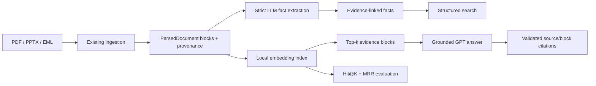

# LLM Document Intelligence & RAG Pipeline

An evaluated document-intelligence portfolio project that parses heterogeneous PDF, PowerPoint, and email-style sources, extracts schema-validated project facts with source evidence, supports local structured search, and answers questions through block-level semantic retrieval with validated citations.

## What it does

- Ingests PDF, PPTX, and EML sources into a common `ParsedDocument` model.
- Extracts practical project facts with strict OpenAI Structured Outputs.
- Hydrates source, block, page, slide, and excerpt provenance in application code.
- Routes ambiguous facts to human review instead of presenting them as certain.
- Searches extracted facts by type and free text without a database.
- Retrieves evidence blocks with local sentence-transformer embeddings and cosine similarity.
- Produces grounded GPT answers whose citations are checked against retrieved blocks.
- Evaluates retrieval on a 15-question, development-only benchmark using Hit@K and MRR.

## Architecture



## Quick demo

These commands use locally generated development `ParsedDocument` JSON. Only the extraction and grounded-answer commands require `OPENAI_API_KEY`.

```powershell
python -m pip install -e ".[dev]"
evaluate-rag-retrieval --parsed-root artifacts/annotations/public_gold_parsed --output artifacts/demo/rag_retrieval_metrics.json
rag-query --parsed-root artifacts/annotations/public_gold_parsed --source-id S002 --question "What compute infrastructure is the government planning?" --top-k 5
extract-project-facts --input artifacts/annotations/public_gold_parsed/S002.json --output artifacts/demo/S002.facts.json
```

Search the extracted result locally:

```powershell
search-project-facts --facts artifacts/demo --type commitment --query "compute"
```

Use retrieval without an API key:

```powershell
rag-search --parsed-root artifacts/annotations/public_gold_parsed --source-id S001 --source-id S002 --source-id S003 --source-id S004 --source-id S006 --query "What compute infrastructure is planned?" --top-k 5
```

Every installed command is also available through the shared module, for example:

```powershell
python -m document_intelligence.portfolio.cli rag-search --parsed-root artifacts/annotations/public_gold_parsed --source-id S002 --query "What compute infrastructure is planned?"
```

## Evaluation

The historical deterministic structured baseline produced 5 true positives, 173 false positives, and 20 false negatives on its development comparison: precision `0.0281`, recall `0.2000`, and F1 `0.0493`. This was measurable but too weak for a useful product interface. A later direct ontology-aligned LLM experiment did not establish an improvement over that baseline. Those engineering results motivated the simpler evidence-ID extraction contract and block-level RAG path now presented here.

The repository includes a labelled 15-question retrieval benchmark spanning development sources S001, S002, S003, S004, and S006. No RAG metric is claimed in this README until the benchmark is run in the target environment:

```powershell
evaluate-rag-retrieval --parsed-root artifacts/annotations/public_gold_parsed --output artifacts/demo/rag_retrieval_metrics.json
```

The output reports `question_count`, `hit_at_1`, `hit_at_3`, `hit_at_5`, and `mean_reciprocal_rank`. Retrieval evaluation is fully local and makes no OpenAI call.

## Tech stack

- Python 3.10+
- Pydantic v2 for strict application and model-output schemas
- OpenAI Responses API with `gpt-5.4-mini`, strict JSON Schema, `store=false`, and no tools
- Sentence Transformers with `all-MiniLM-L6-v2`
- NumPy normalized vectors and cosine similarity
- PyPDF and python-pptx in the existing ingestion layer
- Pytest with injected fake model responses and deterministic fake embeddings

## Evidence-safe fact extraction

The model receives a bounded list of application-generated evidence IDs and block text. It may select an evidence ID, but it cannot supply source IDs, block IDs, page numbers, slide numbers, or excerpts. After schema validation, the application rejects unknown IDs and hydrates provenance from the original `ParsedDocument`.

Illustrative output shape:

```json
{
  "fact_id": "FACT-1A2B3C4D5E6F7890",
  "fact_type": "commitment",
  "subject": "The government",
  "statement": "The government will expand sovereign compute capacity by 2030.",
  "value": "by 2030",
  "evidence_ids": ["S002:DOC-S002-B0006"],
  "confidence": 0.94,
  "support_status": "supported",
  "review_required": false,
  "evidence": [
    {
      "evidence_id": "S002:DOC-S002-B0006",
      "source_id": "S002",
      "block_id": "DOC-S002-B0006",
      "location_type": "page",
      "location_value": "page 5",
      "excerpt": "..."
    }
  ]
}
```

Ambiguous facts must use `support_status="ambiguous"` and `review_required=true`. Unsupported facts are omitted.

## Grounded RAG

RAG operates directly on useful `ParsedDocument` text blocks rather than historical structured candidates. Blocks are embedded locally, normalized, and ranked with cosine similarity. GPT sees only the top-k blocks and must use exact citations such as `[S002:DOC-S002-B0006]`. The application rejects a citation that was not retrieved.

Illustrative answer shape:

```json
{
  "question": "What compute infrastructure is the government planning?",
  "answer": "The plan includes expanding sovereign compute capacity by at least 20 times by 2030 [S002:DOC-S002-B0006].",
  "citations": [
    {
      "evidence_id": "S002:DOC-S002-B0006",
      "source_id": "S002",
      "block_id": "DOC-S002-B0006",
      "location_type": "page",
      "location_value": "page 5"
    }
  ]
}
```

If the retrieved blocks are insufficient, the model is instructed to say so explicitly and return no unsupported citation.

## Testing

The focused portfolio tests do not call OpenAI or download an embedding model:

```powershell
python -m pytest tests/test_portfolio_pipeline.py -q
python -m compileall -q src
```

The tests cover schema validation, ambiguous review routing, unknown evidence rejection, provenance hydration, exact provider controls, structured search, deterministic retrieval ranking, selected-source loading, citation validation, insufficient-evidence responses, metric calculation, development-only benchmark scope, and a CLI smoke path.

## Project structure

```text
src/document_intelligence/
  ingestion/                 # Existing PDF, PPTX and EML parsing
  portfolio/
    models.py                # Lightweight fact, retrieval and RAG contracts
    extraction.py            # Strict fact extraction and evidence hydration
    retrieval.py             # Local embedding index and retrieval metrics
    rag.py                   # Grounded QA and citation validation
    cli.py                   # Five user-facing commands
data/evaluation/
  rag_dev_questions.json     # 15-question development retrieval benchmark
tests/
  test_portfolio_pipeline.py # Focused offline portfolio tests
```

## Limitations

- The 15-question retrieval set is small and development-only; it is useful for a rapid measurable demo, not a generalization claim.
- The first retrieval run downloads the configured sentence-transformer model unless it is already cached locally.
- LLM fact extraction and grounded QA require an OpenAI API key, network access, and paid API usage. There is no automatic retry loop.
- The new lightweight fact contract has focused validation but has not yet been scored as a structured extractor against a dedicated labelled set.
- Cosine search is in memory. It is appropriate for this portfolio corpus, not a large production collection.
- Citations prove that an answer refers to retrieved blocks; human review remains necessary for ambiguous or high-impact claims.
- This is a portfolio prototype, not a production security, availability, or compliance claim.

## Experimental history and engineering lessons

The repository retains the earlier deterministic baselines, direct LLM experiments, manifests, transaction controls, and immutable evidence for auditability. They are historical engineering evidence rather than the product entry point. The main lessons carried into the portfolio layer are:

- evaluate before claiming quality;
- preserve block-level provenance;
- prevent models from inventing evidence coordinates;
- keep unsupported or ambiguous outputs reviewable;
- prefer a small runnable interface over experiment-specific orchestration.

Historical files remain available under `docs/`, `configs/`, `evaluation/`, and `reports/`; none were deleted or rewritten for this product path.
